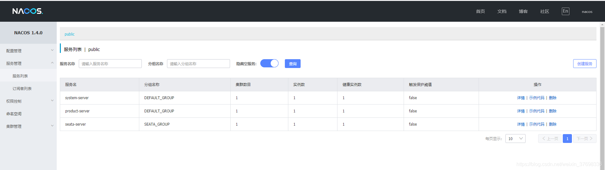

# SpringCloud-秒杀

## 表设计

表设计参考

https://gitee.com/gz-yami/mall4j/blob/master/db/yami_shop.sql

首先设计表结构

- 用户表

```mysql
CREATE TABLE `t_user` (
  `user_id` bigint(20) NOT NULL COMMENT '主键',
  `username` varchar(255)  DEFAULT NULL,
  `login_password` varchar(255) DEFAULT NULL COMMENT '登陆密码',
  `status` int(1) DEFAULT NULL COMMENT '状态 1 正常 0 无效',
  `user_regtime` datetime DEFAULT NULL COMMENT '注册时间',
  PRIMARY KEY (`user_id`)
) ENGINE=InnoDB DEFAULT CHARSET=utf8 COLLATE=utf8_bin;
```

- 商品表

```mysql
CREATE TABLE `t_product` (
  `product_id` bigint(20)  NOT NULL  COMMENT '产品ID',
  `product_name` varchar(300) NOT NULL DEFAULT '' COMMENT '商品名称',
  `product_price` decimal(15,2) DEFAULT '0.00' COMMENT '商品价格',
  `content` text COMMENT '商品描述',
  `total_stocks` int(11) DEFAULT '0' COMMENT '总库存',
  `create_time` datetime DEFAULT NULL COMMENT '录入时间',
  `update_time` datetime DEFAULT NULL COMMENT '修改时间',
   PRIMARY KEY (`product_id`)
) ENGINE=InnoDB AUTO_INCREMENT=78 DEFAULT CHARSET=utf8 COMMENT='商品';
```

- 订单表

```mysql
CREATE TABLE `t_order` (
  `order_id` bigint(20) unsigned NOT NULL AUTO_INCREMENT COMMENT '订单ID',
  `product_id` bigint(20)  NOT NULL COMMENT '产品ID',
  `prod_name` varchar(1000) NOT NULL DEFAULT '' COMMENT '产品名称',
  `user_id` varchar(36) NOT NULL COMMENT '订购用户ID',
  `total` decimal(15,2) NOT NULL DEFAULT '0.00' COMMENT '总值',
  `remarks` varchar(1024) DEFAULT NULL COMMENT '订单备注',
  `status` int(2) NOT NULL DEFAULT '0' COMMENT '订单状态 1:待付款 2:待发货 3:待收货 4:待评价 5:成功 6:失败',
  `product_nums` int(10) DEFAULT NULL COMMENT '订单商品总数',
  `create_time` datetime NOT NULL COMMENT '订购时间',
  `update_time` datetime DEFAULT NULL COMMENT '订单更新时间',
  `pay_time` datetime DEFAULT NULL COMMENT '付款时间',
  `dvy_time` datetime DEFAULT NULL COMMENT '发货时间',
  `finally_time` datetime DEFAULT NULL COMMENT '完成时间',
  `cancel_time` datetime DEFAULT NULL COMMENT '取消时间',
  `is_payed` tinyint(1) DEFAULT NULL COMMENT '是否已经支付，1：已经支付过，0：，没有支付过',
  `delete_status` int(1) DEFAULT '0' COMMENT '用户订单删除状态，0：没有删除， 1：回收站， 2：永久删除',
  `refund_sts` int(1) DEFAULT '0' COMMENT '0:默认,1:在处理,2:处理完成',
  `order_type` tinyint(2) DEFAULT NULL COMMENT '订单类型',
  `close_type` tinyint(2) DEFAULT NULL COMMENT '订单关闭原因 1-超时未支付 2-退款关闭 4-买家取消 15-已通过货到付款交易',
  PRIMARY KEY (`order_id`)
) ENGINE=InnoDB AUTO_INCREMENT=6 DEFAULT CHARSET=utf8 COMMENT='订单表';
```

## 分布式ID生成-leaf

> product/order表的id都是使用leaf生成

### leaf服务配置

### Leaf Server

我们提供了一个基于spring boot的HTTP服务来获取ID

#### 配置介绍

Leaf 提供两种生成的ID的方式（号段模式和snowflake模式），你可以同时开启两种方式，也可以指定开启某种方式（默认两种方式为关闭状态）。

Leaf Server的配置都在leaf-server/src/main/resources/leaf.properties中

| 配置项                    | 含义                          | 默认值 |
| ------------------------- | ----------------------------- | ------ |
| leaf.name                 | leaf 服务名                   |        |
| leaf.segment.enable       | 是否开启号段模式              | false  |
| leaf.jdbc.url             | mysql 库地址                  |        |
| leaf.jdbc.username        | mysql 用户名                  |        |
| leaf.jdbc.password        | mysql 密码                    |        |
| leaf.snowflake.enable     | 是否开启snowflake模式         | false  |
| leaf.snowflake.zk.address | snowflake模式下的zk地址       |        |
| leaf.snowflake.port       | snowflake模式下的服务注册端口 |        |

#### 号段模式

如果使用号段模式，需要建立DB表，并配置leaf.jdbc.url, leaf.jdbc.username, leaf.jdbc.password

如果不想使用该模式配置leaf.segment.enable=false即可。

##### 创建数据表

```
CREATE DATABASE leaf
CREATE TABLE `leaf_alloc` (
  `biz_tag` varchar(128)  NOT NULL DEFAULT '',
  `max_id` bigint(20) NOT NULL DEFAULT '1',
  `step` int(11) NOT NULL,
  `description` varchar(256)  DEFAULT NULL,
  `update_time` timestamp NOT NULL DEFAULT CURRENT_TIMESTAMP ON UPDATE CURRENT_TIMESTAMP,
  PRIMARY KEY (`biz_tag`)
) ENGINE=InnoDB;

insert into leaf_alloc(biz_tag, max_id, step, description) values('leaf-segment-order', 1, 2000, 'Test leaf Segment Mode Get Id')
```

##### 配置相关数据项

在leaf.properties中配置leaf.jdbc.url, leaf.jdbc.username, leaf.jdbc.password参数

#### Snowflake模式

算法取自twitter开源的snowflake算法。

如果不想使用该模式配置leaf.snowflake.enable=false即可。

##### 配置zookeeper地址

在leaf.properties中配置leaf.snowflake.zk.address，配置leaf 服务监听的端口leaf.snowflake.port。

#### 运行Leaf Server

##### 打包服务

```
git clone git@github.com:Meituan-Dianping/Leaf.git
//按照上面的号段模式在工程里面配置好
cd leaf
mvn clean install -DskipTests
cd leaf-server
```

##### 运行服务

*注意:首先得先配置好数据库表或者zk地址*

###### mvn方式

```
mvn spring-boot:run
```

###### 脚本方式

```
sh deploy/run.sh
```

##### 测试

```
#segment
curl http://localhost:8080/api/segment/get/leaf-segment-test
#snowflake
curl http://localhost:8080/api/snowflake/get/test
```

##### 监控页面

号段模式：http://localhost:8080/cache

### Leaf Core

当然，为了追求更高的性能，需要通过RPC Server来部署Leaf 服务，那仅需要引入leaf-core的包，把生成ID的API封装到指定的RPC框架中即可。

### 注意事项

注意现在leaf使用snowflake模式的情况下 其获取ip的逻辑直接取首个网卡ip【特别对于会更换ip的服务要注意】避免浪费workId


## nacos配置中心

- nacos 单机启动服务端-nacos-server-1.4.1
  - startup.cmd -m standalone

## xxl-job分布式调度中心

查看文档安装


## seata

https://blog.csdn.net/weixin_37698336/article/details/111170580

### 下载

```
需要下载seata-1.4.0.zip 和 seata-server-1.4.0.zip两个安装包
下载地址：https://github.com/seata/seata/releases
```

#### seata-server-1.4.0安装配置

##### registry.conf修改：

```
#我使用的nacos作为配置中心和注册中心，使用将配置文件改为nacos

registry {
# file 、nacos 、eureka、redis、zk、consul、etcd3、sofa
  type = "nacos"
  loadBalance = "RandomLoadBalance"
  loadBalanceVirtualNodes = 10

  nacos {
    application = "seata-server"
    serverAddr = "127.0.0.1:8848"
    group = "SEATA_GROUP"
    namespace = ""
    cluster = "default"
    username = "nacos"
    password = "nacos"
  }
}

config {
  # file、nacos 、apollo、zk、consul、etcd3
  type = "nacos"
  nacos {
    serverAddr = "127.0.0.1:8848"
    namespace = ""
    group = "SEATA_GROUP"
    username = "nacos"
    password = "nacos"
  }
}

```

##### file.conf修改：

```
#修改数据库地址，注意mysql5/mysql8驱动不同

store {
  ## store mode: file、db、redis
  mode = "db"
	## database store property
	  db {
	    ## the implement of javax.sql.DataSource, such as DruidDataSource(druid)/BasicDataSource(dbcp)/HikariDataSource(hikari) etc.
	    datasource = "druid"
	    ## mysql/oracle/postgresql/h2/oceanbase etc.
	    dbType = "mysql"
	    driverClassName = "com.mysql.cj.jdbc.Driver"
	    url = "jdbc:mysql://127.0.0.1:3307/seata?serverTimezone=Asia/Shanghai&useUnicode=true&characterEncoding=utf8&useSSL=true"
	    user = "root"
	    password = "123456"
	    minConn = 5
	    maxConn = 100
	    globalTable = "global_table"
	    branchTable = "branch_table"
	    lockTable = "lock_table"
	    queryLimit = 100
	    maxWait = 5000
	  }
	}

```

### 创建数据库

```sql
-- 创建数据库seata,并建立下面三张表（branch_table, global_table, lock_table），创建undo_log表放到业务库中
-- the table to store GlobalSession data

create database IF NOT EXISTS `seata` default character set utf8 collate utf8_bin;
use `seata`;

drop table if exists `global_table`;
create table `global_table` (
  `xid` varchar(128)  not null,
  `transaction_id` bigint,
  `status` tinyint not null,
  `application_id` varchar(32),
  `transaction_service_group` varchar(32),
  `transaction_name` varchar(128),
  `timeout` int,
  `begin_time` bigint,
  `application_data` varchar(2000),
  `gmt_create` datetime,
  `gmt_modified` datetime,
  primary key (`xid`),
  key `idx_gmt_modified_status` (`gmt_modified`, `status`),
  key `idx_transaction_id` (`transaction_id`)
);
 
-- the table to store BranchSession data
drop table if exists `branch_table`;
create table `branch_table` (
  `branch_id` bigint not null,
  `xid` varchar(128) not null,
  `transaction_id` bigint ,
  `resource_group_id` varchar(32),
  `resource_id` varchar(256) ,
  `lock_key` varchar(128) ,
  `branch_type` varchar(8) ,
  `status` tinyint,
  `client_id` varchar(64),
  `application_data` varchar(2000),
  `gmt_create` datetime,
  `gmt_modified` datetime,
  primary key (`branch_id`),
  key `idx_xid` (`xid`)
);
 
-- the table to store lock data
drop table if exists `lock_table`;
create table `lock_table` (
  `row_key` varchar(128) not null,
  `xid` varchar(96),
  `transaction_id` long ,
  `branch_id` long,
  `resource_id` varchar(256) ,
  `table_name` varchar(32) ,
  `pk` varchar(36) ,
  `gmt_create` datetime ,
  `gmt_modified` datetime,
  primary key(`row_key`)
);
 
-- the table to store seata xid data
-- 0.7.0+ add context
-- you must to init this sql for you business databese. the seata server not need it.
-- 此脚本必须初始化在你当前的业务数据库中，用于AT 模式XID记录。与server端无关（注：业务数据库）
-- 注意此处0.3.0+ 增加唯一索引 ux_undo_log
drop table `undo_log`;
CREATE TABLE `undo_log` (
  `id` bigint(20) NOT NULL AUTO_INCREMENT,
  `branch_id` bigint(20) NOT NULL,
  `xid` varchar(100) NOT NULL,
  `context` varchar(128) NOT NULL,
  `rollback_info` longblob NOT NULL,
  `log_status` int(11) NOT NULL,
  `log_created` datetime NOT NULL,
  `log_modified` datetime NOT NULL,
  `ext` varchar(100) DEFAULT NULL,
  PRIMARY KEY (`id`),
  UNIQUE KEY `ux_undo_log` (`xid`,`branch_id`)
) ENGINE=InnoDB AUTO_INCREMENT=1 DEFAULT CHARSET=utf8;

```

### 启动seata-server服务

> seata-1.4\bin目录下：双击 seata-server.bat
> nacos中查看服务是否注册成功



### seata-1.4.0.配置

#### 修改config.txt

> 路径：seata-1.4.0 路径下 script\config-center
>
> 注意: service.vgroupMapping.miaosha-tx-group=default,  对应的是springcloud的tx-service-group: miaosha-tx-group
>
> 
>
> service.vgroupMapping.sub-tx-group=default
> service.vgroupMapping.miaosha-tx-group=default

修改service.vgroupMapping和数据库地址

transport.type=TCP
transport.server=NIO
transport.heartbeat=true
transport.enableClientBatchSendRequest=false
transport.threadFactory.bossThreadPrefix=NettyBoss
transport.threadFactory.workerThreadPrefix=NettyServerNIOWorker
transport.threadFactory.serverExecutorThreadPrefix=NettyServerBizHandler
transport.threadFactory.shareBossWorker=false
transport.threadFactory.clientSelectorThreadPrefix=NettyClientSelector
transport.threadFactory.clientSelectorThreadSize=1
transport.threadFactory.clientWorkerThreadPrefix=NettyClientWorkerThread
transport.threadFactory.bossThreadSize=1
transport.threadFactory.workerThreadSize=default
transport.shutdown.wait=3
service.vgroupMapping.my_test_tx_group=default
service.default.grouplist=127.0.0.1:8091
service.enableDegrade=false
service.disableGlobalTransaction=false
client.rm.asyncCommitBufferLimit=10000
client.rm.lock.retryInterval=10
client.rm.lock.retryTimes=30
client.rm.lock.retryPolicyBranchRollbackOnConflict=true
client.rm.reportRetryCount=5
client.rm.tableMetaCheckEnable=false
client.rm.sqlParserType=druid
client.rm.reportSuccessEnable=false
client.rm.sagaBranchRegisterEnable=false
client.tm.commitRetryCount=5
client.tm.rollbackRetryCount=5
client.tm.defaultGlobalTransactionTimeout=60000
client.tm.degradeCheck=false
client.tm.degradeCheckAllowTimes=10
client.tm.degradeCheckPeriod=2000
store.mode=db
store.file.dir=file_store/data
store.file.maxBranchSessionSize=16384
store.file.maxGlobalSessionSize=512
store.file.fileWriteBufferCacheSize=16384
store.file.flushDiskMode=async
store.file.sessionReloadReadSize=100
store.db.datasource=druid
store.db.dbType=mysql
store.db.driverClassName=com.mysql.jdbc.Driver
store.db.url=jdbc:mysql://127.0.0.1:3306/seata?characterEncoding=utf8&useSSL=false&serverTimezone=UTC
store.db.user=root
store.db.password=root
store.db.minConn=5
store.db.maxConn=30
store.db.globalTable=global_table
store.db.branchTable=branch_table
store.db.queryLimit=100
store.db.lockTable=lock_table
store.db.maxWait=5000
store.redis.host=127.0.0.1
store.redis.port=6379
store.redis.maxConn=10
store.redis.minConn=1
store.redis.database=0
store.redis.password=null
store.redis.queryLimit=100
server.recovery.committingRetryPeriod=1000
server.recovery.asynCommittingRetryPeriod=1000
server.recovery.rollbackingRetryPeriod=1000
server.recovery.timeoutRetryPeriod=1000
server.maxCommitRetryTimeout=-1
server.maxRollbackRetryTimeout=-1
server.rollbackRetryTimeoutUnlockEnable=false
client.undo.dataValidation=true
client.undo.logSerialization=jackson
client.undo.onlyCareUpdateColumns=true
server.undo.logSaveDays=7
server.undo.logDeletePeriod=86400000
client.undo.logTable=undo_log
client.log.exceptionRate=100
transport.serialization=seata
transport.compressor=none
metrics.enabled=false
metrics.registryType=compact
metrics.exporterList=prometheus
metrics.exporterPrometheusPort=9898

service.vgroupMapping.sub-tx-group=default
service.vgroupMapping.miaosha-tx-group=default

### 启动nacos-config.sh,将配置注入到nacos中

在seata-server-1.4.0\script\config-center\nacos目录下，右键 Git Bash Here


输入命令：
sh nacos-config.sh -h 127.0.0.1 -p 8848 -g SEATA_GROUP -u nacos -w nacos

## SpringCloud 配置

### pom.xml

注：seata-spring-boot-starter的版本与安装版本一致

```xml
<dependency>
        <groupId>com.alibaba.cloud</groupId>
        <artifactId>spring-cloud-starter-alibaba-seata</artifactId>
        <exclusions>
            <exclusion>
                <groupId>io.seata</groupId>
                <artifactId>seata-spring-boot-starter</artifactId>
            </exclusion>
        </exclusions>
    </dependency>
    <dependency>
        <groupId>io.seata</groupId>
        <artifactId>seata-spring-boot-starter</artifactId>
        <version>1.4.0</version>
    </dependency>


```

### 修改yml配置文件

```yaml
seata:
  enabled: true
  application-id: ${spring.application.name}
  tx-service-group: miaosha-tx-group
  enable-auto-data-source-proxy: true
  config:
    type: nacos
    nacos:
      namespace:
      server-addr: 127.0.0.1:8848
      group: SEATA_GROUP
      userName: "nacos"
      password: "nacos"
  registry:
    type: nacos
    nacos:
      application: seata-server
      server-addr: 127.0.0.1:8848
      namespace:
      userName: "nacos"
      password: "nacos"
```

### 代码上添加注解

```
application启动类上添加：
@EnableAutoDataSourceProxy
service上添加：
@GlobalTransactional(rollbackFor = Exception.class)
```


## shardingsphere


springcloud nacos/feign/sentinel/getway/admin


## 端口问题

| 应用               | 端口 |
| ------------------ | ---- |
| leaf-server        | 8081 |
| sentinel-dashboard | 8082 |
| xxl-job-admin      | 8084 |
| seata-server       | 8091 |


订单超时处理: 

​	https://mp.weixin.qq.com/s/5GVuU8NQJJ3tNq4Loa3xlg


## sentinel

https://blog.csdn.net/a____a23456/article/details/107319244

[
    {
        "resource": "/hello",
        "limitApp": "default",
        "grade": 1,
        "count": 5,
        "strategy": 0,
        "controlBehavior": 0,
        "clusterMode": false
    }
]


## rocketmq

\2. 配置
2.1 系统环境变量配置
变量名：ROCKETMQ_HOME
变量值：MQ解压路径\MQ文件夹名
eg、ROCKETMQ_HOME=D:\dev\rocketmq-all-4.3.0-bin-release

\3. 启动
3.1 启动NAMESERVER
Cmd命令框执行进入至‘MQ文件夹\bin’下，然后执行‘**start mqnamesrv.cmd**’，启动NAMESERVER。成功后会弹出提示框，此框勿关闭。


3.2 启动BROKER
Cmd命令框执行进入至‘MQ文件夹\bin’下，然后执行‘**start mqbroker.cmd -n 127.0.0.1:9876 autoCreateTopicEnable=true**’，启动BROKER。成功后会弹出提示框，此框勿关闭。


## 测试点

1. 超卖的问题
2. 分布式事务的问题

